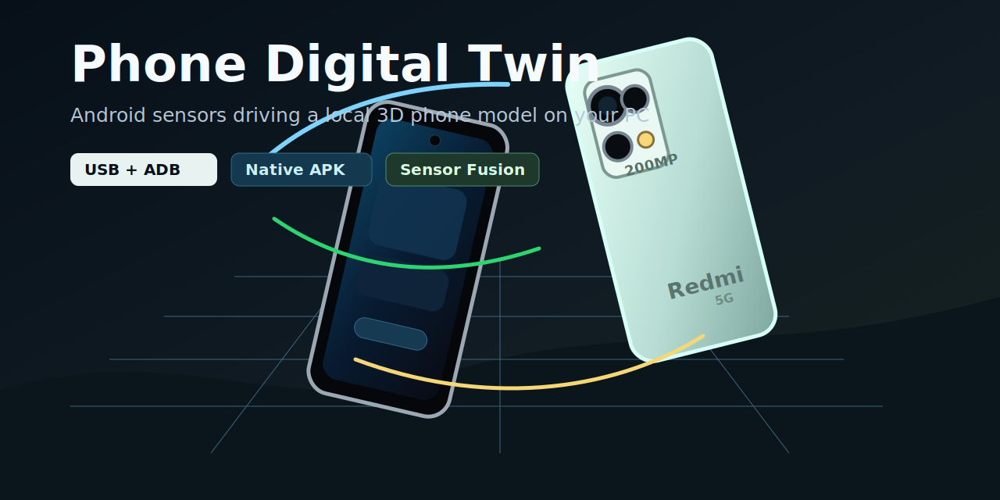

<p align="center">
  
</p>

# Phone Digital Twin

Phone Digital Twin turns an Android phone into a live sensor controller for a local 3D phone model on your PC. The PC renders the digital twin; the phone streams Android rotation-vector data over fast UDP/LAN, HTTP, or USB/ADB.

The current prototype includes a Xiaomi Redmi Note 13 Pro styled model, but the sensor pipeline works with most Android phones that expose rotation-vector and motion sensors.

## What It Does

- Renders a local 3D phone twin on Windows.
- Mirrors real phone rotation using Android rotation-vector/quaternion data.
- Uses a foreground Android service so streaming continues while recording, switching apps, or turning the APK screen away.
- Supports low-latency UDP streaming for smoother motion.
- Supports USB tunneling with `adb reverse`.
- Includes a native Android sensor sender APK project.
- Includes a browser sensor bridge as a quick fallback.
- Provides scripts and docs so other Codex users can reproduce the setup.

## Quick Start: LAN + Native APK

1. Start the PC web twin:

```powershell
.\run_web_twin.bat
```

2. Open the PC viewer:

```text
http://localhost:8876/
```

3. On Android, download the APK from the PC URL shown by the server:

```text
http://IP_DEL_PC:8876/apk/phone-digital-twin.apk
```

4. In the APK, use UDP for smooth motion:

```text
udp://IP_DEL_PC:5005
```

5. Tap `Iniciar envio`. The foreground service keeps streaming until you return to the APK and tap `Parar envio`.

## Quick Start: USB + Native APK

1. Enable Developer Options on Android.
2. Enable `USB debugging`, `Install via USB`, and `USB debugging (Security settings)` if your Xiaomi/MIUI/HyperOS exposes it.
3. Connect the phone by USB and accept the RSA prompt.
4. Start the PC twin with `.\run_web_twin.bat`.
5. Install/open the Android sender with `.\scripts\install_apk_usb.ps1`.
6. In the phone app, use `http://127.0.0.1:8876/sensor`.
7. Tap `Iniciar envio`.

## Quick Start: USB + Browser Bridge

If you do not want to install the APK:

```powershell
.\scripts\start_usb_browser_bridge.ps1
```

Then tap `Iniciar sensores` in Chrome on the phone.

## PC Controls

- Drag mouse: orbit camera.
- Mouse wheel: zoom.
- `P` + `Q` held for 2 seconds: pause/resume sensor ingestion on the PC server.
- `Calibrar`: set the current phone orientation as neutral.
- `Reset calibracion`: clear calibration.
- `Reset vista`: reset camera orbit/zoom.

## Accuracy Notes

Rotation can be very good because Android fuses accelerometer, gyroscope and magnetometer into rotation-vector/quaternion sensors.

Absolute XYZ position is intentionally disabled in the current smooth mode. A phone accelerometer measures acceleration, not position; double integration drifts quickly. The project prioritizes stable real-time rotation. For true physical position tracking, the next step is ARCore/camera tracking, visual markers, UWB, or external tracking.

## Project Layout

```text
web_digital_twin_server.py     Web twin server, HTTP/UDP sensor receiver, APK download
web_digital_twin.html          Browser-based PC digital twin viewer
redmi_desktop_twin.py          Legacy Tkinter renderer and sensor receiver
mobile_sensor_bridge.html      Browser fallback sensor bridge
android-sensor-sender/         Native Android APK source
scripts/                       setup, build, install, publish helpers
docs/                          images and manuals
```

## For Codex Users

Use this repository as a starting point for phone-controlled digital twins, sensor visualizers, field-data capture, vibration studies, HMI prototypes, and Android-to-PC engineering workflows.

See:

- [USB + ADB setup](docs/USB_ADB_SETUP.md)
- [Android sensor options](docs/ANDROID_SENSOR_SOLUTIONS.md)
- [USB debugging + Codex ideas](docs/DEPURACION_USB_CODEX.md)
- [Native APK notes](docs/NATIVE_APK.md)

## Publish Your Fork

This repository includes a PowerShell publisher that asks for a GitHub token and uploads the clean source tree:

```powershell
.\scripts\publish_to_github.ps1
```

It excludes local SDKs, Gradle caches, platform-tools downloads and build outputs.
